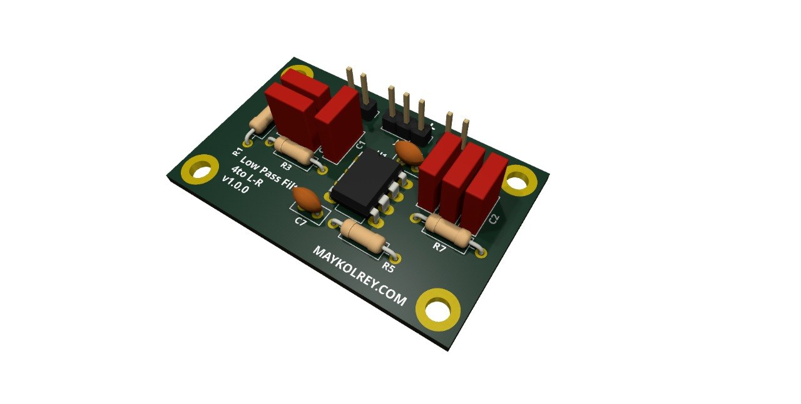
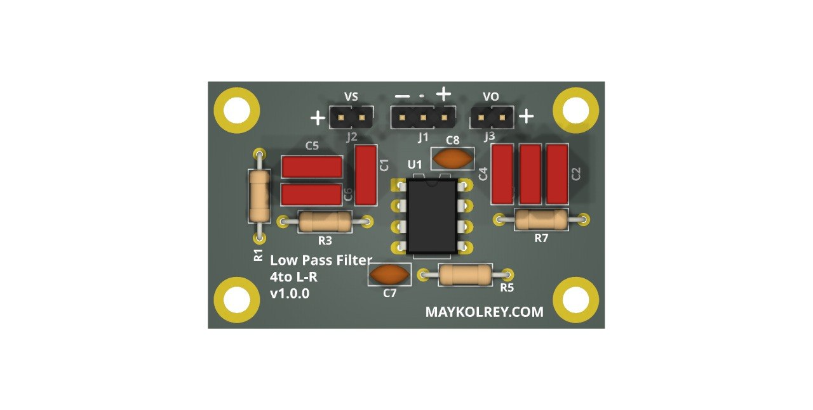
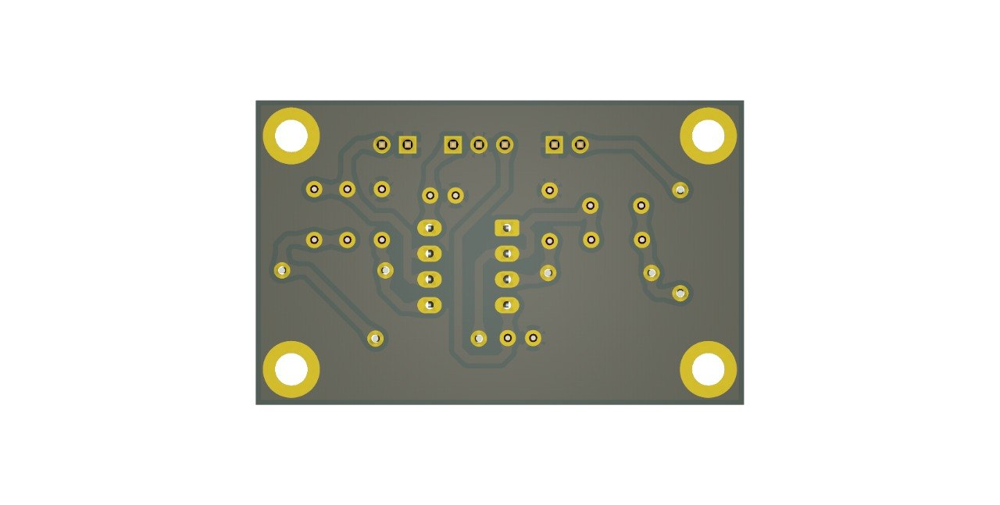

# low-pass-filter-lr4

Filtro pasa bajos activo Linkwitz-Riley de cuarto orden, pensado para subwoofer o cruces activos en sistemas de audio.

## Qué incluye
- esquemáticos o archivos de diseño en KiCad
- PCB o documentación asociada
- base reutilizable para análisis, fabricación o mejora del proyecto

## Propósito general
Este repositorio busca concentrar el diseño de hardware del proyecto en un formato editable y reutilizable, facilitando pruebas, documentación y futuras iteraciones del circuito.

## Lista de materiales (BOM)

| referencia | valor | footprint |
| --- | --- | --- |
| C1 | 22nF | `Capacitor_THT:C_Rect_L7.2mm_W2.5mm_P5.00mm_FKS2_FKP2_MKS2_MKP2` |
| C2 | 22nF | `Capacitor_THT:C_Rect_L7.2mm_W2.5mm_P5.00mm_FKS2_FKP2_MKS2_MKP2` |
| C3 | 22nF | `Capacitor_THT:C_Rect_L7.2mm_W2.5mm_P5.00mm_FKS2_FKP2_MKS2_MKP2` |
| C4 | 22nF | `Capacitor_THT:C_Rect_L7.2mm_W2.5mm_P5.00mm_FKS2_FKP2_MKS2_MKP2` |
| C5 | 22nF | `Capacitor_THT:C_Rect_L7.2mm_W2.5mm_P5.00mm_FKS2_FKP2_MKS2_MKP2` |
| C6 | 22nF | `Capacitor_THT:C_Rect_L7.2mm_W2.5mm_P5.00mm_FKS2_FKP2_MKS2_MKP2` |
| C7 | 100nF | `Capacitor_THT:C_Disc_D5.0mm_W2.5mm_P2.50mm` |
| C8 | 100nF | `Capacitor_THT:C_Disc_D5.0mm_W2.5mm_P2.50mm` |
| J1 | Conn_01x03 | `Connector_PinHeader_2.54mm:PinHeader_1x03_P2.54mm_Vertical` |
| J2 | Conn_01x02 | `Connector_PinHeader_2.54mm:PinHeader_1x02_P2.54mm_Vertical` |
| J3 | Conn_01x02 | `Connector_PinHeader_2.54mm:PinHeader_1x02_P2.54mm_Vertical` |
| R1 | 33k | `Resistor_THT:R_Axial_DIN0207_L6.3mm_D2.5mm_P10.16mm_Horizontal` |
| R3 | 33k | `Resistor_THT:R_Axial_DIN0207_L6.3mm_D2.5mm_P10.16mm_Horizontal` |
| R5 | 33k | `Resistor_THT:R_Axial_DIN0207_L6.3mm_D2.5mm_P10.16mm_Horizontal` |
| R7 | 33k | `Resistor_THT:R_Axial_DIN0207_L6.3mm_D2.5mm_P10.16mm_Horizontal` |
| U1 | NE5532 | `Package_DIP:DIP-8_W7.62mm_LongPads` |

## Vista del proyecto

### Render 3D del PCB

### Render del módulo y layout del PCB

  
  

